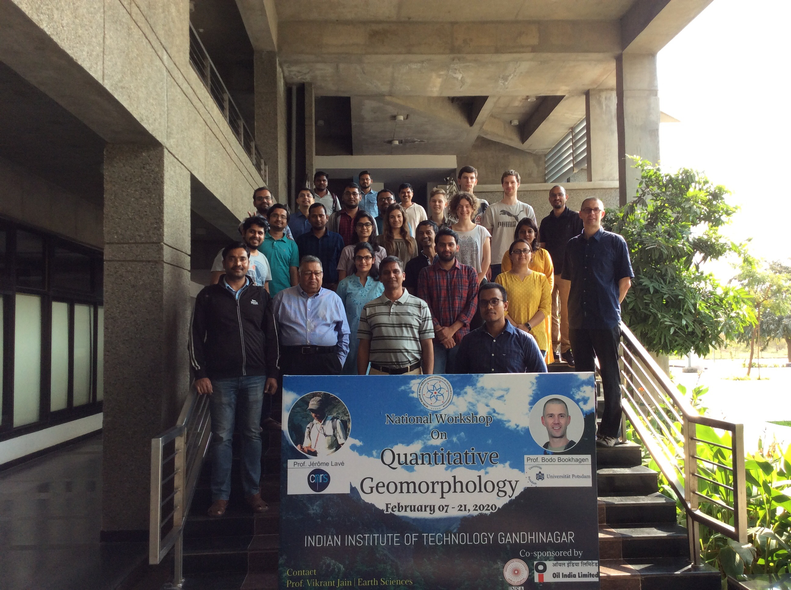

# Workshop on Quantitative Geomorphology
### Quantitative Geomorphology Workshop at IIT Gandhinagar in February 2020, organized by Prof. Vikrant Jain

The workshop consists of several lectures and lab exercises. On this github page, some of the exercises pertinent to Digital Elevation Model (DEM) analysis, Landscape Evolution Model (LEM) Exercises, and PointCloud (PC) analysis are included. Additional reference material is included as well.
Please see [QGeomorph_Workshop_Required_Software.pdf](docs/QGeomorph_Workshop_Required_Software.pdf)

*Monday, 17.02.2020*
- Introduction to [Digital Elevation Model](lectures/Lecture1_DEM_lr.pdf) analysis
- Introduction to [Tectonic Geomorphology](lectures/Lecture2_TectonicGeomorphology_lr.pdf)
- Exercises with Python using synthetic and real-world DEMs:
  - Creating a Gaussian Hill and performing analytical and numerical slope calculations ([Python](DEM/GaussianHill/gaussian_hill.py), [Jupyter-Notebook](DEM/GaussianHill/Gaussian%20Hill%20and%20DEM%20analysis.ipynb), [PDF](DEM/GaussianHill/Gaussian Hill and DEM analysis.pdf))
  - Performing FlowDirection and FlowAccumulation calculation on a Gaussian Hill ([Python](DEM/GaussianHill/gaussian_hill_richdem.py), [Jupyter-Notebook](DEM/GaussianHill/Gaussian Hill - FlowDirection and FlowAccumulation.ipynb), [PDF](DEM/GaussianHill/Gaussian Hill - FlowDirection and FlowAccumulation.pdf))
  - Hypsometry and Slope Distributions of Earth and Mars ([Jupyter Notebook](DEM/Earth_Mars/Earth and Mars Hypsometry.ipynb), [PDF](DEM/Earth_Mars/Earth and Mars Hypsometry.pdf))
- Resampling and gridding artifacts
- Comparing slope and hypsometry of Earth and Mars, exploring 2D histograms
- Flow Direction and Flowaccumulation calculation

*Tuesday, 18.02.2020*
- Introduction to [Landscape Evolution Modeling (LEM)](lectures/Lecture3_LandscapeEvolutionModels_lr.pdf) using [landlab](https://landlab.readthedocs.io/en/master/)
- Some simple modeling exercises:
  - Fault-scarp modeling using linear diffusion [Python](LEM/landlab_faultscarp_lineardiffusion.py)
  - Uplift of a block for plateau and escarpment modeling (diffusion only: [Python](LEM/landlab_block_uplift.py) and fluvial erosion: [Python](LEM/landlab_block_uplift_FSE.py))
  - Setting up a growing anticline with spatially varying uplift rates [Python](LEM/landlab_growing_anticline.py)
  - Linear Diffusion and fluvial erosion of a Gaussian Hill ([Python](LEM/landlab_GaussianHill.py), [Jupyter Notebook]("LEM/LEM - Gaussian Hill.ipynb"), [PDF]("LEM/LEM - Gaussian Hill.pdf"))
  - Forward modeling of a real landscape - loading a DEM for the Baspa Valley (NW Himalaya) and model diffusional and fluvial erosion processes ([Python](LEM/landlab_Baspa_from_DEM.py), [Jupyter Notebook]("LEM/Baspa - Landlab Modeling from a DEM.ipynb"), [PDF]("LEM/Baspa - Landlab Modeling from a DEM.pdf")

*Wednesday, 19.02.2020*
- Introduction to [Lidar and Point Cloud (PC) analysis](lectures/L4_Lidar_lr.pdf)
- Using a Terrestrial Lidar scanner to generate your own point Cloud outside
- PC analysis, visualization and classification using open-source tools
- Ground classification and gridding of PC data to generate high-resolution DTMs:
  - Using PDAL to ground-classify PCs and generate DTMs for the University of Potsdam Campus Golm ([PDF](PointClouds/PC_pdal_for_UP_CampusGolm.pdf)) and the Santa Cruz Island, California ([PDF](PointClouds/PC_pdal_for_SCI_from_USGS_Lidar.pdf))

*Thursday, 19.02.2020*
- Introduction of Matlab [TopoToolbox](https://topotoolbox.wordpress.com/)
- Exercises in the computer lab: relief, steepness indices, identifying knick points, chi analysis

*Friday, 19.02.2020*
- Examples and Exercises from the Himalaya
